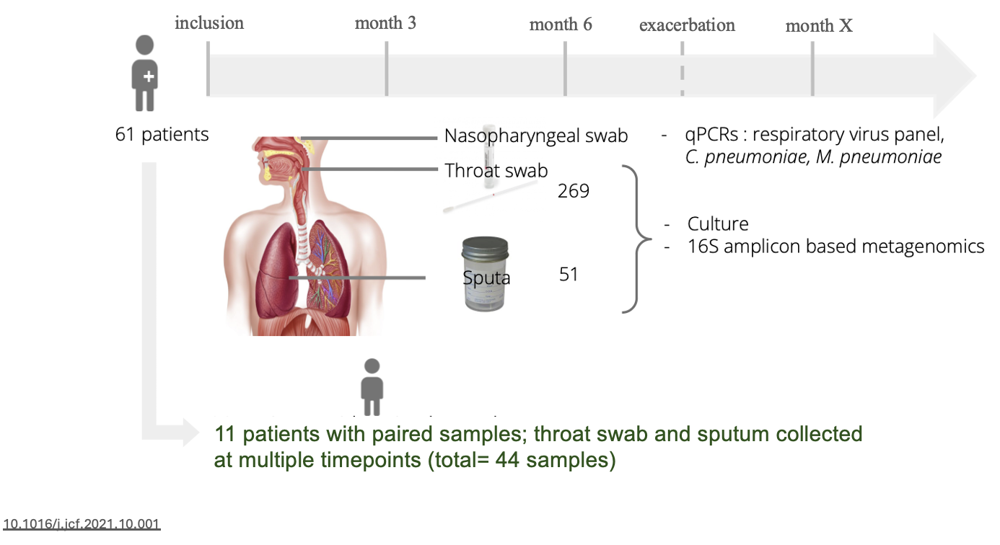

# **Practical Session: Microbiome Analysis**

## **Part 1:**

### **Introduction to the study**

The composition of our microbiome is not static; it is shaped by various internal and external factors throughout life, from birth to adulthood. Early influences include genetics, and even birth mode, which help establish a diverse microbiota. As we grow, factors such as diet, exercises continue to modify microbial communities. This study focuses on a life-limiting genetic disease typically diagnosed by age two.

Cystic fibrosis unfolds as a story of resilience against a genetic adversity, where the mutation in the CFTR gene ,that maintains the balance of salt and water across cell membranes,results in an overproduction of thick, sticky mucus that obstructs the lungs and obstruct the pancreas. For patients, this means a struggle to breathe and a battle against frequent lung infections.

</br>

> **Figure 1: Mutations in the CFTR gene, thick and sticky mucus production**

> {: width:"100%" .center}

</br>

### **Role of the microbiota**


Tracking of the lower respiratory tract microbiota stands as a critical tool in this struggle, offering deep insights into the lung's microbial landscape. Because in CF, the diversity of the microbial community in the lungs can change significantly with different stages of the disease. Normally, a diverse microbiome in the lungs is associated with better respiratory health. Healthy lungs contain a diverse and balanced microbiota, mostly dominated by anaerobes and commensal bacteria such as Veillonella, and Prevotella and is like an island whose population is determined by balance of immigration and elimination of species. 

In CF lungs, the thick mucus provides an ideal environment for opportunistic bacteria and pathogens to colonize. As the disease progresses and repeated antibiotic treatments are administered, microbial diversity decreases. In the early stages, Staphylococcus aureus and Haemophilus species are commonly found, but later, colonization by Pseudomonas and the formation of a thick biofilm layer make sputum clearance and treatment significantly more difficult. 

The Climax-Attack Model (CAM) in CF explains the dynamic changes in airway microbiota.

</br>

> **Figure 2: Microbiome shifts in CF**

> {: width:"100%" .center}

</br>

By understanding these microbial profiles and their shift in disease stages, physicians can customize treatments, adjusting antibiotics to stop infections from developing or spreading, keeping an eye on emerging drug resistances, and ultimately enhancing the quality of life for those with cystic fibrosis. 

</br>

### **Surveillance in CF**

1. **Cinical Monitoring:** Regular clinic visits for physical examinations
2. **Microbiological Monitoring:** Regular collection of expectorated sputum and bronchoalveolar lavage (BAL) and analysing by microbial culture to identify bacteria or fungi that may be present in the lungs.

</br>

### **Problem Statement:**

**It is relatively difficult to collect BAL and sputum in pediatric setting as children often do not have the ability to expectorate sputum because they either swallow it or do not understand how to cough it up effectively when requested.**

</br>

### **Aim of the study**

Evaluating non-invasive respiratory sampling methods for young children in medical settings

_"Can throat swabs serve as an effective alternative to sputum for the longitudinal assessment of lung microbial diversity and pathogen identification in patients who cannot expectorate?"_

</br>
> {: width:"100%" .center}

</br>

1. Is the bacterial diversity in throat swab samples similar to that in sputum samples?
2. Is the bacterial composition of throat swabs similar to that of sputum samples?
3. Can throat swabs detect microbial shifts associated with CF exacerbations as effectively as sputum samples?
4. How efficient are throat swabs in detecting known pathogens in CF patients compared to sputum samples?

</br>

### **Study design**

Traditional culture techniques have been the cornerstone of microbiological monitoring in cystic fibrosis (CF), but they come with certain limitations. Some bacteria are hard to culture, or they grow too slowly to be detected promptly, and cultures may miss many non-culturable or fastidious organisms. That's where 16S amplicon-based metagenomics adds significant value.
</br>

> **Figure 3: Study design and sample collection**

> {: width:"100%" .center}

</br>

## **Part 2:**

### **Methods**

Amplicon-based metagenomics is a method focused on the amplification and sequencing of specific genomic regions, most often targeting the 16S rRNA genes that is ubiquitous in prokaryotes and hence allows to identify the members of a bacterial community. Each 16S rRNA gene has an approximate length of 1600 base pairs and includes nine hypervariable regions of varying conservation (V1-V9) interspersed by conserved sequences. Primers are designed on conserved sequences to allow the amplification of a maximum of bacterial and archaeal taxa, in our case on both side of the V3-V4 region. This strategy allows for short read sequencing of the amplicons and hence maximizes cost efficiency while minimizing technical challenges associated with amplification and analysis.

Overall, the variable regions of the 16S rRNA gene present sufficient sequence diversity to differentiate between microbial Genera, and often even at the Species level. The selection of a reference database for taxonomical annotation significantly impacts the quality of the prediction and the taxonomical resolution.

After sequencing, raw reads were processed using [zAMP](https://rsp4abm.readthedocs.io/en/latest/index.html), a [DADA2](https://www.ncbi.nlm.nih.gov/pmc/articles/PMC4927377/)-based bioinformatics pipeline.

</br>

> **Figure 4: 16S amplicon-based metagenomics workflow**

> {: width:"100%" .center}

</br>
</br>

> **Figure 5: DADA2 workflow**

> {: width:"100%" .center}

</br>
</br>

??? info "**Code**"
      ```r 
      # Call phyloseq library
      library(phyloseq)
      #Read phyloseq object from the folder
      phyloseq <- readRDS("/path_to_your_folder/base_with_tree.rds")

      #Subset only paired sputum and throat swab samples collected in the same day of the visit from phyloseq that contains samples of full cohort
      phyloseq_pairs <- prune_samples(x = phyloseq, as.character(metadata_pairs$Sample))

      # Remove taxa with 0 counts
      phyloseq_pairs <- prune_taxa(taxa_sums(phyloseq_pairs) > 0, phyloseq_pairs)

      #Extract bacterial abundance table from phyloseq object
      Count_table <- data.frame(otu_table(phyloseq_pairs))
      #Extract metadata table from phyloseq object
      metadata <- data.frame(sample_data(phyloseq_pairs))
      #Extract taxonomy table table from phyloseq object
      taxonomy_table <- data.frame(tax_table(phyloseq_pairs))
      ```
</br>

> **Figure 6: Structure of data in phyloseq**

> {: width:"100%" .center}

</br>

## **Part 3:**

### **Analysis**

!!! question "**Question 1**"
    Is the bacterial diversity in throat swab samples similar to that in sputum samples? Does this similarity changes by patient's exacerbation?

??? info "**Code**"
      ```r 
      # Call required libraries
      library(tidyverse)
      library(knitr)
      library(stringr)
      library(readxl)
      library(gridExtra)
      library(dplyr)
      library(ggplot2)
      library(cowplot)
      library(vegan)
      library(RColorBrewer)
      library(microbiome)
      library(pairwiseAdonis)
      library(randomcoloR)

      # Function to process phyloseq and plot alpha diversity
      Alpha_diversity <- function(phyloseq, output_folder) {

      # Calculate alpha diversity indices
      tab <- microbiome::alpha(phyloseq, index = "all")

      # Add diversity indices to sample metadata
      ps1_meta <- sample_data(phyloseq)
      ps1_meta$Shannon <- tab$diversity_shannon
      ps1_meta$chao1 <- tab$chao1
      sample_data(phyloseq) <- ps1_meta

      # Ensure Sample_type or your sample_group column in metadata is a factor and create color mapping
      ps1_meta$Sample_type <- factor(ps1_meta$Sample_type)
      sample_types <- levels(ps1_meta$Sample_type)
      n_colors <- length(sample_types)
      colors <- brewer.pal(min(n_colors, 8), "Dark2")
      # Adjust palette based on number of groups that you have
      if (n_colors > 8) {  # Cycle through colors if more than 8 groups
      colors <- rep(colors, length.out = n_colors)
      }
      color_map <- setNames(colors, sample_types)


      # Create combinations for pairwise comparisons
      bmi.pairs <- combn(Sample_type, 2, simplify = FALSE, FUN = function(i) Sample_type[i])

      # Plotting function
      plot_alpha_diversity <- function(index_name, x_label, y_label) {
      microbiome::boxplot_alpha(phyloseq, index = index_name, x_var = "Sample_type",
                                violin = FALSE, show.points = TRUE, zeroes = TRUE,
                                outlier.fill = "white",
                                fill.colors = color_map) +
      theme_minimal() +
      labs(x = x_label, y = y_label) +
      theme(axis.text = element_text(size = 12),
            axis.title = element_text(size = 16),
            legend.position = "top") +
      ylim(0, NA) +
      stat_compare_means(comparisons = bmi.pairs, paired = TRUE, label = "p.format", method =   "wilcox.test")
      }

      # Create plots
      p1 <- plot_alpha_diversity("Chao1", "Observed")
      p2 <- plot_alpha_diversity("shannon", "Shannon")

      # Combine and save plots
      final_plot <- gridExtra::grid.arrange(p1, p2, ncol = 1)
      output_filename <- file.path(output_folder, "Alpha_diversity.svg")
      ggsave(output_filename, final_plot, device = "svg", width = 7, height = 8, dpi = 300)
      }


      #Define output folder
      output_folder < "path_to_your_output_folder"

      # Example of using the function
      Alpha_diversity(phyloseq_pairs, output_folder)
      ```

</br>
> **Figure 7: Microbiome diversity in throat swabs and sputum**

> {: width="560px" width:"100%" .center}

</br>
</br>

??? info "**Answer**"

    **Chao1 Diversity Index:** For both pulmonary exacerbations and regular follow-up, the p-values (0.69 and 0.78, respectively) suggest that the difference in the number of observed species between sputum and throat swabs is not statistically significant. This means that the throat swabs have a similar species richness to that of sputum samples for the patient.
    </br>
    **Shannon Diversity Index:** Similarly, the p-values (1 and 0.25) indicate no statistically significant difference in the microbial diversity of sputum versus throat swabs during both pulmonary exacerbations and regular follow-up.

    **The clinical status during exacerbations, which is typically marked by increased symptoms and decreased lung function, does not seem to significantly affect the ability of throat swabs to capture microbial diversity.**


!!! question "**Question 2**"  
    Is the bacterial composition of throat swabs similar to that of sputum samples?

??? info "**Code**"

    ```r
    # Function to process phyloseq and plot beta diversity (Bray-Curtis/ Jaccard distance)
    Beta_diversity <- function(phyloseq, output_folder, distance_methods) {

    # Aggregate to species level and normalize
    phyloseq_species <- aggregate_taxa(phyloseq, "Species") %>%
    microbiome::transform("compositional")

    # Remove taxa with 0 counts
    phyloseq_species <- prune_taxa(taxa_sums(phyloseq_species) > 0, phyloseq_species)

    # Extract count table for distance calculations
    otu.tab <- data.frame(t(otu_table(phyloseq_species)))

    # Extract top 10 taxa for plot
    top10 <- microbiome::top_taxa(phyloseq_species, 10)
    physeq10.com <- subset_taxa(phyloseq_species, Species %in% top10)
    physeq10.com <- t(physeq10.com@otu_table)
    #Replace NAs in the count table with zeros to avoid calculation errors
    physeq10.com[is.na(physeq10.com)] = 0
    top10Species <- colnames(physeq10.com)

    plots <- list()
    for (method in distance_methods) {
    # Calculate Jaccard and Bray-Curtis distances between samples
    distance <- vegdist(otu.tab, method = ifelse(method == "jaccard", "jaccard", "bray"), binary = (method == "jaccard"))
    ###If the method variable equals "jaccard", then it uses "jaccard"; otherwise, it defaults to "bray".

    #Set seed for reproducibility in NMDS
    set.seed(42)

    # NMDS ordination on the Jaccard and/or Bray-Curtis distance matrix
    nmds_g <- metaMDS(distance)

    # Extract NMDS scores for each sample and merge them with metadata
    data.scores_g <- as.data.frame(scores(nmds_g, display = "sites"))
    #Remove any rows with missing data to avoid errors in plotting
    data.scores_g <- na.omit(data.scores_g)
    #Extract metadata from the phyloseq object
    meta_g <- data.frame(sample_data(phyloseq_P_species))
    data.scores_g <- merge(data.scores_g, meta_g, by = 0, all = TRUE)

    #Clean up row names after merging
    row.names(data.scores_g) <- data.scores_g$Row.names
    data.scores_g <- data.scores_g[, !(names(data.scores_g) %in% c("Row.names"))]

    # Fit top species vectors to the NMDS
    en_g <- envfit(nmds_g, physeq10.com, permutations = 999)
    en_coord_cont_g <- as.data.frame(scores(en_g, "vectors"))

    #Calculate median coordinates of NMDS for each sample type to find the centroid
    cent_g <- aggregate(cbind(NMDS1, NMDS2) ~ Sample_type, data = data.scores_g, FUN = median)
    cent_g$Sample_type <- factor(cent_g$Sample_type, levels = names(colorCode))

    #Store the stress value of the NMDS for reporting
    stress <-round(nmds_g$stress, digits = 2)

    #Calculate the average age for each patient and merge with the main data frame
    average_ages <- aggregate(Age ~ patient, data = data.scores_g, FUN = mean)
    data.scores_g <- merge(data.scores_g, average_ages, by = "patient")
    #Round the average age values to a whole number
    data.scores_g$Age.y <- round(data.scores_g$Age.y)
    # Define color code based on sample groups dynamically
    sample_types <- levels(factor(data.scores_g$Sample_type))
    colors <- brewer.pal(min(length(sample_types), 8), "Dark2")
    if (length(sample_types) > 8) {
    colors <- rep(colors, length.out = length(sample_types))
    }
    colorCode <- setNames(colors, sample_types)

    # Plotting NMDS with ggplot2
    NMDS_plot <- ggplot(data = data.scores_g, aes(x = NMDS1, y = NMDS2, colour = Sample_type)) +
    geom_point(aes(shape = Sample_type, size = Age.y), alpha = 0.7)+  #Plot points with size mapped to average age
    geom_vline(xintercept = c(0), color = "grey70", linetype = "longdash", size =0.3) + #Add vertical line at x=0 for reference
    geom_hline(yintercept = c(0), color = "grey70", linetype = "longdash", size =0.3) + #Add horizontal line at y=0 for reference
    geom_point(data=cent_g, aes(x = NMDS1, y = NMDS2, colour = Sample_type), shape = 16, size = 4, alpha = 0.5) + #Plot centroids for sample types
    scale_color_manual(values = colorCode)+  #Set custom colors for sample type
    scale_size_continuous(name = "Average Age")+  #Add a legend for point sizes (average age)
    stat_ellipse(geom = "polygon",aes(fill = Sample_type), alpha = 0.15, linetype = 2) + #Add ellipses to group samples by type
    geom_segment(aes(x = 0, y = 0, xend = NMDS1*1, yend = NMDS2*1), arrow = arrow(length = unit(0.1, "cm")),
    data = en_coord_cont_g, size =0.2, alpha = 0.5, colour = "black", linetype = 2) + #Draw vectors for species
    geom_text_repel(data = en_coord_cont_g, aes(x = NMDS1*1, y = NMDS2*1),  #Add species names with labels
    colour = "black", fontface = "bold", label = row.names(en_coord_cont_g), size=3)+
    scale_fill_manual(values=colorCode)+
    theme(plot.title = element_text(size = 9),
    plot.subtitle = element_text(size = 9))+
    geom_point(alpha = 0.7) +
    scale_color_manual(values = colorCode) +
    theme_bw() + #Apply a theme with a white background
    labs(title = "NMDS using " + method + " distance")

    # Save the plot
    output_filename <- file.path(output_folder, paste("NMDS_", method, "_Plot.svg", sep=""))
    ggsave(output_filename, NMDS_plot, device = "svg", width = 10)
    }
    }

    # Read phyloseq object from the path
    phyloseq <- readRDS("path_to_your_folder/base_with_tree.rds")

    #Define output folder
    output_folder < "path_to_your_output_folder"

    distance_methods = c("bray", "jaccard")

    # Example of using the function
    Beta_diversity(phyloseq_pairs, output_folder, distance_methods)
    ```
</br>

> **Figure 8: Comparison of microbiome composition between throat swabs and sputum**

> {: width:"100%" .center}

</br>
</br>

??? info "**Answer**"

    Based on the provided Non-metric Multidimensional Scaling (NMDS) plots which compare beta diversity of microbial communities from sputum and throat swab samples using Bray-Curtis and Jaccard distances, here’s an interpretation:

    **NMDS Plot with Bray-Curtis- abundance of bacteria (Left side):**

    - Stress: 0.22 (Acceptable: < 0.2 is ideal, but < 0.3 is considered a good representation of data in ecological studies).
    - PERMANOVA: 0.001 (The low p-value indicates that there are significant differences in microbial composition between sputum and throat swab samples).
    - The ellipses that represent the 95% confidence areas for the sputum (green) and throat swabs (orange) are somewhat overlapping, yet distinct, which suggests there is some similarity but also notable differences in microbial composition between the two sample types.


    **NMDS Plot with Jaccard distance- presecne/absence of bacteria (right side):**

    - Stress: 0.15 (Considered a good representation).
    - PERMANOVA: 0.54 (The high p-value suggests there is no significant difference in community membership - simply which organisms are present or absent, not their abundances - between the two sample types).
    - The ellipses overlap more here compared to the Bray-Curtis plot, indicating a greater similarity in presence/absence data of the species sampled in throat swabs and sputum.

      The significant result in the Bray-Curtis NMDS indicates differences in the abundance of species, while the non-significant Jaccard result suggests that the same species are present in both sample types.
      These findings could imply that while the types of bacteria present in throat swabs and sputum are similar (species membership), the proportions (abundance) of these bacteria differ, which is clinically relevant as abundance can influence disease state and treatment response.

!!! question "**Bonus question**"  
    How does the age of a patient appear to influence the microbial community composition in the respiratory tract, based on the beta diversity shown in the NMDS plots for both sputum and throat swab samples?

!!! question "**Question 3**"  
    Can throat swabs detect microbial shifts associated with CF exacerbations as effectively as sputum samples?

> **Figure 9: Comparison of microbiome composition between throat swabs and sputum in exacerbation phase**
>
> {: width:"100%" .center}

</br>
</br>

??? info "**Answer**"
    The statistical test suggests that in the exacerbation phase, the sample type (sputum vs. throat swab) does not significantly affect the microbial composition within the same visits, with p-values of 0.12 and 0.58 for Bray-Curtis and Jaccard distances respectively. However, the timing of the visit influences bacterial abundance, as indicated by the significant p-value of 0.04 for Bray-Curtis distance, suggesting that factors related to individual visits (such as disease state, treatment, or environmental conditions) may play a more significant role than the type of sample collected. let's discover this in next question.


!!! question "**Question 4**"
Do sputum and throat swab samples cluster more strongly by sample type or patient identity? What might this indicate about the nature of airway microbiota in children with CF?


??? info "**Answer**"
      Samples clustered by the individuals rather than by the sample type (pairwise PERMANOVA, p = 0.001). This suggests that each patient harbors a unique, individual-specific microbiota in their airways that is more consistent across different sample types (sputum vs. throat swab) than across individuals. This could reflect personal environmental exposure, genetic background, or medical treatment history.

</br>

> **Figure 10: Microbial community composition clusters by patient identity rather than sample type**
>
> {: width:"100%" .center}

</br>
</br>


!!! question "**Question 5**"  
    How efficient are throat swabs in detecting known pathogens in CF patients compared to sputum samples?

??? info "**Code**"

      ```r


      #Code for looking into the abundance of pathogen of interest in each sample group
      # 1) Read phyloseq object in R
      # 2) Transform it to phyloseq with relative abundances
      # 3) subset your pathogen of interest (you can use subset_taxa() function)
      # 4) Use aggregate_taxa() to have phyloseq with species level

      # list of pathogen of interest:
      # - Pseudomonas aeruginosa
      # - Staphylococcus aureus
      # - Achromobacter_sp
      # - Haemophilus influenzae
      # - Moraxella nonliquefaciens
      # - Stenotrophomonas_sp

      # phyloseq_species was normalised to relative abundances and aggregated to species level
      ps_pathogen <- subset_taxa(phyloseq_species, Species %in% c("Pseudomonas aeruginosa",
                                "Staphylococcus aureus",
                                "Achromobacter_sp",
                                "Haemophilus influenzae",
                                "Moraxella nonliquefaciens",
                                "Stenotrophomonas_sp"))

      #melt the phyloseq object
      PS_abund_melt <- psmelt(ps_pathogen)

      #now sum up all ASVs from same sequencing run that assigned to the same species
      colnames(PS_abund_melt)

      PS_SumASV <- PS_abund_melt %>%
                  group_by(Sample, sample_types, patient, visit, patient_visit, Species) %>%
                  summarise_at(vars(Abundance),  # Specify column
                  list(Abundance_sum = sum))

      #final table to use with pathogens of interest
      Final_table <- PS_SumASV[PS_SumASV$Species %in% c ("Pseudomonas aeruginosa",
                                                                  "Staphylococcus aureus",
                                                                  "Achromobacter_sp",
                                                                  "Haemophilus influenzae",
                                                                  "Moraxella nonliquefaciens",
                                                                  "Stenotrophomonas_sp"), ]
      table(Final_table$Species, Final_table$patient_visit)

      ## plot Heatmaps

      Pathogen_table <- ggplot(Final_table, aes(x= sample_types, y= Species, fill= Abundance_sum)) +
        geom_tile() +
        facet_grid(~ patient_visit) +
        scale_fill_viridis(discrete=FALSE, name="Abundance (%)") +
        xlab(label = "Sample")+
        theme(axis.text.x=element_text(angle=90, hjust=1),
              strip.text.x = element_text(angle = 90, hjust=1)) +
        coord_equal()

      ggsave(Pathogen_table, filename = "heatmap_patientvisit.jpeg", height=4, width=12, dpi = 300)

      ```
</br>
> **Figure 11: Validity of throat swabs for pathogen detection compared to sputum** > {: width="560px" width:"100%" .center}


??? info "**Answer**"

    **Pathogen presence:** For each pathogen listed on the y-axis, you can see whether it was detected (green) or not detected (white) in each type of sample during various patient visits (shown on the x-axis).

    **Sample comparison:** By comparing the green bars for each pathogen in sputum versus throat swabs across patient visits, you can assess whether throat swabs consistently show the presence of these pathogens as often as sputum samples do.

    **Detection consistency:** Consistent detection in both sample types across multiple patient visits would suggest throat swabs are as efficient as sputum samples in detecting these pathogens. Conversely, if certain pathogens are frequently present in sputum samples but not in throat swabs, it could indicate that throat swabs may miss some pathogens that are detectable in sputum.

    **Pathogen-specific efficiency:** The efficiency of throat swabs may vary for different pathogens. For example, if Staphylococcus aureus is consistently detected in both sputum and throat swabs, but Pseudomonas aeruginosa is often missed in throat swabs, this would indicate pathogen-specific differences in detection efficiency.

**How you would conclude?**
